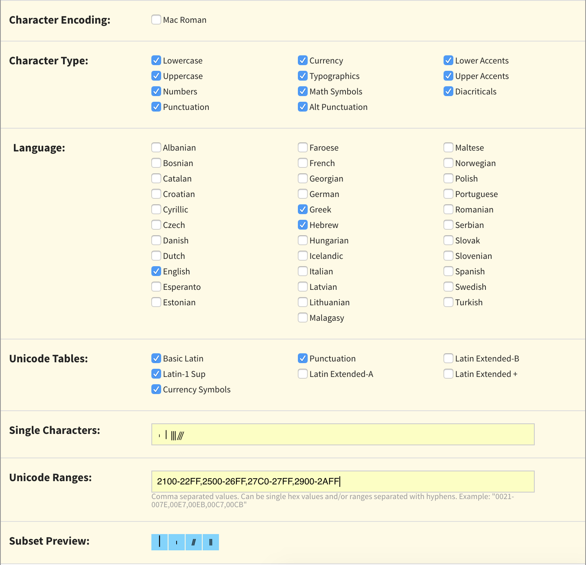

# MSQuill

This repository holds MathSpace's private fork of [MathQuill](https://mathquill.com).

To submit upstream pull requests, use our [public fork](https://github.com/mathspace/mathquill).

## Building

MathQuill's source code requires compilation before it may be consumed by a browser.  MathQuill uses `make` (🤷) to orchestrate this compilation.

To build the default MathQuill bundle, run:

```bash
$ make clean
$ make
```

This will output CSS and JS files in the `/build/` directory suitable for direct consumption by a web browser.

To build in watch mode:

```bash
$ make clean
$ make server
```

After launching the server, it is possible to try the code you've built by opening: http://localhost:9292/test/demo.html.

### Debugging for Mathspace NWE (React based applications)

In order to debug the React app, both the build server and react webpack server need to be running concurrently. 


### Debugging for Mathspace

You may also wish to test MathQuill with Mathspace specific configuration and styles.  It is possible to do this by launching:

```bash
$ make clean
$ make server
```

and opening http://localhost:9292/jsmvc/math_components/latex_editor/latex_editor.html

**N.B.** This was made possible by cloning a very old snapshot of some CanJS code from our Mathspace repository.  It will not accurately reflect the current Mathspace experience.

**N.B.** ❗ [[@ajhyndman](github.com/ajhyndman)] There is presently a race condition in module loading.  I believe it is currently possible for `mathquill.js` to load and execute before `jQuery` is available.  In practice, this means that sometimes you may need several refreshes before MathQuill runs correctly.

### Publishing a new release

Our core [Mathspace application](https://github.com/mathspace/mathspace) pulls its MathQuill dependency directly from Github.  This means that compiled code must be committed in each release.

To publish a new release:

1. Build a CommonJS module ready for consumption by Webpack

```bash
$ make clean
$ make mathspace
```

2. Merge latest code into master
3. Create a new release tag (requires repository admin access)
  * Install [`np`](https://github.com/sindresorhus/np), if not already available.

```bash
$ npm install --global np
```

  * Run `np` and follow the prompts.

```bash
$ np
```

## Customisations

Ideally, any customisations to MathQuill should be encapsulated in one of the following folders:

* `src/commands/mathspace/`
* `src/css/mathspace/`

This is intended to make upstream change merging easier.

## Regenerating the fonts

The source version of Symbola (contains all ~7800 characters) can be found on Fonts2U:

https://fonts2u.com/symbola.font

To reduce payload size and optimise browser rendering, we have run Symbola
through FontSquirrel's webfont generator with the following character set
selected:



## Updating to latest upstream master

Unfortunately, we haven't done a very good job, historically, of segregating our Mathspace customisations from core code.  This means that there isn't a very good story for merging upstream changes into our codebase.

Note from [@ajhyndman](github.com/ajhyndman): The most promising solution I can imagine is to use git to attempt to rebase all `msquill` repository changes written by Mathspace devs on top of upstream master.  This will involve a *lot* of clever merge conflict resolution!

As of 09-05-2018, the most recent upgrade attempt can be found here: https://trello.com/c/JrJz3DLI/20-upgrade-mathquill.

## Known issues

* Configuration options are not delegated to child `\editable{}` fields.
  * https://trello.com/c/MtTzCZhP
* Pressing backspace in `\text{}` expressions will not allow you to delete the `\text` node.
  * https://trello.com/c/98EnpoqK
